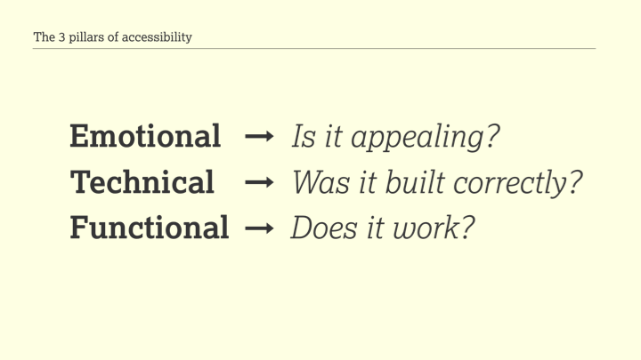
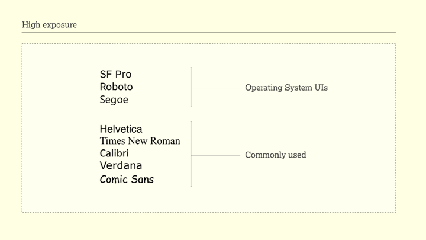
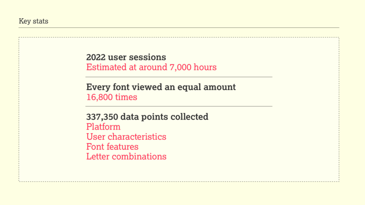
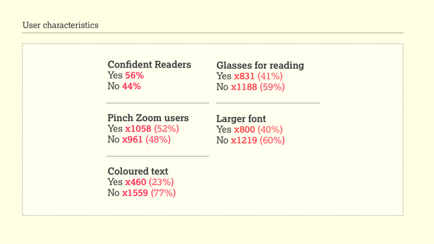
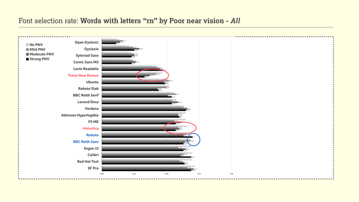
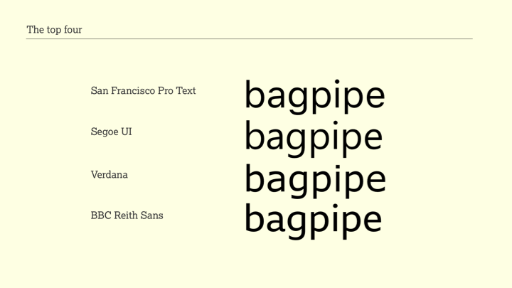
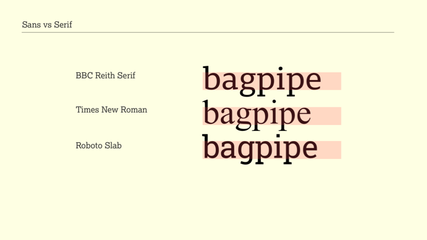

# Don’t believe the type

Converted to Markdown / HTML from images in [the slides (14MB, PPTX)](https://github.com/thibaudcolas/readability-group-survey/blob/main/The%20Readability%20Group%20-%20Axe%20Con%202021%20_%20Dont%20Believe%20the%20Type.pptx). Readability Group Survey and presentation by: [David Bailey](https://medium.com/@davidkiosk), [Gareth Ford Williams](https://medium.com/@garethfordwilliams), [Bruno Maag](https://medium.com/@bruno-maag). Image descriptions in this document: ChatGPT / GPT-4, under supervision and with editorial changes from [@thibaudcolas](https://github.com/thibaudcolas).

## Slide 1 - Don’t believe the type

The text reads "Don't believe the type."

## Slide 2 - The Readability Group

This slide features names and social media handles of three individuals:

- David Bailey (@davidkiosk)
- Gareth Ford Williams (@GarethFW)
- Bruno Maag (@bruno_maag)

## Slide 3 - The Readability Group survey

On the laptop screen, the word "bagpipe" is displayed twice side by side.

## Slide 4 - The 3 pillars of accessibility

Lists the three pillars of accessibility:

- Emotional
- Technical
- Functional

## Slide 5 - The 3 pillars of accessibility

Lists the "3 pillars of accessibility" and includes:

- Emotional → Is it appealing?
- Technical → Was it built correctly?
- Functional → Does it work?

## Slide 6 - The 3 pillars of accessibility

Highlights the term "Emotional" from the first slide with a red circle and an arrow pointing to it, reiterating its connection to the question "Is it appealing?"

## Slide 7 - Brand expression

Shows three different examples of typefaces used in branding:

- The first example shows a colorful alphabet in a casual, child-like typeface associated with Nickelodeon.
- The second example displays four weights (light, regular, medium, bold) of the Intel brand font, labeled "intel one."
- The third example states "Handwritten lettering defines the LUSH brand".
- The fourth example states "Horseferry & Chadwick – a family of display and information fonts by Channel 4"

## Slide 8 - Brand expression

Compares two images:

- The left image features two people, one holding a Burberry check pattern bag, both wearing coats and styled in a vintage fashion with the Burberry logo underneath.
- The right image shows two people in modern styling, wearing Burberry check pattern clothes, with the updated Burberry London England logo beneath them.

There is a red arrow pointing from the left image to the right one, indicating a progression or change in brand expression over time.

## Slide 9 - Brand expression

- Left side shows two versions of the Burberry logo. The first logo has a knight on a horse carrying a flag and is accompanied by the text "BURBERRY" and below it "LONDON".
- Right side shows an updated version of the Burberry logo with a more modern sans-serif typeface. The word "BURBERRY" is larger and below it is the text "LONDON ENGLAND".

## Slide 10 Fashion vs function

An image of an ancient manuscript with Gothic script text. It's a close-up showing detailed blackletter calligraphy. A red cursor is visible in the text.

## Slide 11 - Fashion vs function

There are three elements:

- The logo for "The New York Times" in its distinctive typeface at the top.
- Below left, an album cover for "Motörhead England 1975" featuring the iconic Snaggletooth emblem.
- Below right, a photograph of a person's knuckles, with each knuckle tattooed to spell out "TRUE LOVE".

## Slide 12 - Fashion vs function

A close-up image of a hand holding an ancient text with German Gothic script. The text is dense and meticulously written.

## Slide 13 - Striking a balance

An illustration of a finger pushing a scale balance between the words "EMOTIONAL" and "FUNCTIONAL."

## Slide 14 - The Readability Group survey

A two-column list of font names is presented. Left Column:

- Atkinson Hyperlegible
- BBC Reith Sans
- BBC Reith Serif
- Calibri
- Comic Sans
- Dyslexie
- FSM
- Helvetica
- Lexend Deca
- LexieReadable

Right Column:

- Open Dyslexic
- Red Hat
- Roboto
- Roboto Slab
- Segoe
- SF Pro
- Sylexiad Sans
- Times New Roman
- Ubuntu
- Verdana

## Slide 15 - High exposure

A list indicating the exposure level of different fonts.

High exposure fonts used in "Operating System UIs":

- SF Pro
- Roboto
- Segoe

Fonts noted as "Commonly used":

- Helvetica
- Times New Roman
- Calibri
- Verdana
- Comic Sans

## Slide 16 - Key stats

2022 user sessions

Estimated at around 7,000 hours

---

Every font viewed an equal amount

16,800 times

---

337,350 data points collected

- Platform
- User characteristics
- Font features
- Letter combinations

## Slide 17 - Font features

Alphabet characters displayed in a colorful and overlapping design. The letters shown are: a b c d e f g h i j k l m n o p.

## Slide 18 - User characteristics

- **Confident Readers**: Yes 56%, No 44%
- **Glasses for reading**: Yes x831 (41%), No x1188 (59%)
- **Pinch Zoom users**: Yes x1058 (52%), No x961 (48%)
- **Larger font**: Yes x800 (40%), No x1219 (60%)
- **Coloured text**: Yes x460 (23%), No x1559 (77%)

## Slide 19 - Poor near vision

Pie chart depicting percentages for poor near vision:

- strong: 18.4%
- moderate: 11.7%
- mild: 16.1%
- no: 53.8%

## Slide 20 - Phonological Dyslexia characteristics

Pie chart showing percentages for phonological dyslexia characteristics:

- strong: 12.5%
- moderate: 8.7%
- mild: 13.7%
- no: 65.0%

## Slide 21 - Font selection rate: All participants

The bar chart compares how individuals read different fonts. Each font has one bar. The lengths of the bars represent readability scores on a scale from 0 to 1, with longer bars indicating higher readability.

| Font                  | Selection rate |
| --------------------- | -------------- |
| Open Dyslexic         | 0.12           |
| Dyslexie              | 0.22           |
| Comic Sans MS         | 0.22           |
| Sylexiad Sans: 0.34   | 0.39           |
| Lexie Readable        | 0.44           |
| Times New Roman       | 0.49           |
| Roboto Slab           | 0.51           |
| Ubuntu                | 0.54           |
| Lexend Deca Helvetica | 0.54           |
| BBC Reith Serif       | 0.55           |
| Calibri               | 0.58           |
| FS ME                 | 0.58           |
| Roboto                | 0.62           |
| Atkinson Hyperlegible | 0.62           |
| Red Hat Text          | 0.62           |
| Verdana               | 0.64           |
| BBC Reith Sans        | 0.64           |
| Segoe UI              | 0.66           |
| SF Pro                | 0.69           |

## Slide 22 - Font selection rate: Dyslexic traits - No/Strong

The chart compares how individuals with and without strong dyslexia read different fonts. Each font has two bars, one representing readers without dyslexia and one for those with strong dyslexia. The lengths of the bars represent readability scores on a scale from 0 to 1, with longer bars indicating higher readability.

| Font                  | No dyslexic | Strong dyslexic |
| --------------------- | ----------- | --------------- |
| Open Dyslexic         | 0.09        | 0.18            |
| Dyslexie              | 0.19        | 0.30            |
| Comic Sans MS         | 0.20        | 0.28            |
| Stylexiad Sans        | 0.33        | 0.36            |
| Lexie Readable        | 0.37        | 0.44            |
| Times New Roman       | 0.46        | 0.36            |
| Roboto Slab           | 0.50        | 0.47            |
| Ubuntu                | 0.50        | 0.54            |
| Lexend Deca           | 0.52        | 0.62            |
| BBC Reith Serif       | 0.56        | 0.54            |
| Helvetica             | 0.57        | 0.47            |
| Calibri               | 0.58        | 0.55            |
| FS ME                 | 0.59        | 0.56            |
| Red Hat Text          | 0.62        | 0.6             |
| Atkinson Hyperlegible | 0.63        | 0.6             |
| BBC Reith Sans        | 0.64        | 0.65            |
| Roboto                | 0.64        | 0.57            |
| Verdana               | 0.64        | 0.64            |
| Segoe UI              | 0.67        | 0.62            |
| SF Pro                | 0.70        | 0.65            |

## Slide 23 - Font selection rate: Poor near vision - No/Strong

The chart compares how individuals with and without poor near vision (PNV) read different fonts. Each font has two bars, one representing readers with no poor near vision and one for those with strong poor near vision. The lengths of the bars represent readability scores on a scale from 0 to 1, with longer bars indicating higher readability.

| Font                  | No PNV | Strong PNV |
| --------------------- | ------ | ---------- |
| Open Dyslexic         | 0.10   | 0.12       |
| Dyslexie              | 0.19   | 0.25       |
| Comic Sans MS         | 0.21   | 0.24       |
| Sylexiad Sans         | 0.32   | 0.36       |
| Lexie Readable        | 0.36   | 0.41       |
| Times New Roman       | 0.46   | 0.41       |
| Roboto Slab           | 0.50   | 0.47       |
| Ubuntu                | 0.51   | 0.52       |
| Lexend Deca           | 0.53   | 0.55       |
| BBC Reith Serif       | 0.56   | 0.54       |
| Helvetica             | 0.57   | 0.51       |
| Calibri               | 0.58   | 0.58       |
| FS ME                 | 0.60   | 0.57       |
| Atkinson Hyperlegible | 0.63   | 0.61       |
| BBC Reith Sans        | 0.63   | 0.65       |
| Red Hat Text          | 0.63   | 0.63       |
| Roboto                | 0.63   | 0.6        |
| Verdana               | 0.63   | 0.64       |
| Segoe UI              | 0.67   | 0.66       |
| SF Pro                | 0.70   | 0.68       |

## Slide 24 - Font selection rate: Words with letters "rn" by Poor near vision - All

The chart compares how individuals with different degrees poor near vision (PNV) read different fonts for words with letters "rn". Each font has four bars, one representing readers with no poor near vision, one with mild poor near vision, one for moderate, and one for those with strong poor near vision. The lengths of the bars represent readability scores on a scale from 0 to 1, with longer bars indicating higher readability.

| Font                  | No PNV | Mild PNV | Moderate PNV | Strong PNV |
| --------------------- | ------ | -------- | ------------ | ---------- |
| Open Dyslexic         | 0.10   | 0.16     | 0.14         | 0.11       |
| Dyslexie              | 0.18   | 0.24     | 0.29         | 0.25       |
| Sylexiad Sans         | 0.20   | 0.25     | 0.25         | 0.23       |
| Comic Sans MS         | 0.21   | 0.24     | 0.26         | 0.23       |
| Lexie Readable        | 0.39   | 0.43     | 0.45         | 0.47       |
| Times New Roman       | 0.44   | 0.42     | 0.37         | 0.33       |
| Ubuntu                | 0.48   | 0.52     | 0.48         | 0.49       |
| Roboto Slab           | 0.49   | 0.5      | 0.43         | 0.44       |
| BBC Reith Serif       | 0.53   | 0.57     | 0.51         | 0.54       |
| Lexend Deca           | 0.55   | 0.54     | 0.59         | 0.54       |
| Verdana               | 0.61   | 0.63     | 0.66         | 0.65       |
| Atkinson Hyperlegible | 0.62   | 0.59     | 0.59         | 0.6        |
| FS ME                 | 0.62   | 0.56     | 0.61         | 0.57       |
| Helvetica             | 0.63   | 0.59     | 0.6          | 0.57       |
| Roboto                | 0.65   | 0.65     | 0.63         | 0.7        |
| BBC Reith Sans        | 0.66   | 0.68     | 0.64         | 0.63       |
| Segoe UI              | 0.66   | 0.59     | 0.65         | 0.63       |
| Calibri               | 0.67   | 0.63     | 0.61         | 0.69       |
| Red Hat Text          | 0.67   | 0.6      | 0.63         | 0.64       |
| SF Pro                | 0.69   | 0.66     | 0.71         | 0.69       |

## Slide 25 - Legibility

- The word "kernel" is displayed with certain parts of each letter highlighted to show legibility issues.
- Below the main word, there are three instances of the word "kernel" with additional text:
  - "kernel furnished surname" in Times New Roman font.
  - "kernel furnished surname" in Roboto font.

## Slide 26 - The test platform

Four phrases are listed, likely representing factors considered in the test platform:

- Font Choices
- Typographic Design Decisions
- Accessibility Barriers
- User Preferences

## Slide 27 - The top four

The phrase "The top four" is followed by four examples of the word "bagpipe" in different fonts:

- San Francisco Pro Text
- Segoe UI
- Verdana
- BBC Reith Sans

## Slide 28 - Design features

This slide lists the design features of the fonts displayed on the previous slide:

- San Francisco Pro Text - Grotesque sans serif
- Segoe UI - Humanist sans serif
- Verdana - Humanist sans serif
- BBC Reith Sans - Humanist sans serif

## Slide 29 - Design features

This slide shows the design features of different fonts, with the word "bagpipe" used as an example:

- San Francisco Pro Text - Grotesque sans serif
- Segoe UI - Humanist sans serif
- Verdana - Humanist sans serif
- BBC Reith Sans - Humanist sans serif

## Slide 30 - Design features

This slide shows the design features of different fonts, with the word "bagpipe" used as an example:

- San Francisco Pro Text - Grotesque sans serif
- Helvetica

## Slide 31 - Design features

This slide shows the design features of different fonts, with the word "bagpipe" used as an example:

- Humanist sans serif

## Slide 32 - Design features

This slide shows the design features of different fonts, with the word "bagpipe" used as an example:

- San Francisco Pro Text
- Segoe UI
- Ubuntu

## Slide 33 - Poor performers

This slide shows the design features of different fonts, with the word "bagpipe" used as an example:

- Open Dyslexia
- Dyslexie
- Comic Sans

## Slide 34 - Sans vs Serif

This slide shows the design features of different fonts, with the word "bagpipe" used as an example:

- BBC Reith Sans
- BBC Reith Serif

## Slide 35 - Sans vs Serif

This slide shows the design features of different fonts, with the word "bagpipe" used as an example:

- BBC Reith Serif
- Times New Roman
- Roboto Slab

## Slide 36 - Sizing

The word "bagpipe" is shown three times, each in a different size and weight to demonstrate sizing in typography.

## Slide 37 - Sizing

The word "bagpipe" is shown three times, each in a different size and weight to demonstrate sizing in typography.

## Slide 38 - More to learn

A variety of words in different sizes and weights to show the range of typography, including:

- magpie
- gymnast
- doorknob
- manmade
- thermos
- cupboard
- paella
- flutter
- windows
- bagpipe
- waffle
- prologue
- chimney
- jazzy

## Slide 39 - This is just the beginning

A list of different scripts from various languages:

- Armenian
- Greek
- Malayalam
- Japanese
- Bengali
- Khmer
- Sinhala
- Cyrillic
- Kannada
- Tamil
- Latin
- Hebrew
- Chinese
- Georgian
- Devanagari
- Telugu
- Thai
- Arabic

## Slide 40 - Thank you

A thank you note:

- "Thank you"
- thereadability.group
- @ReadabilityGrp
