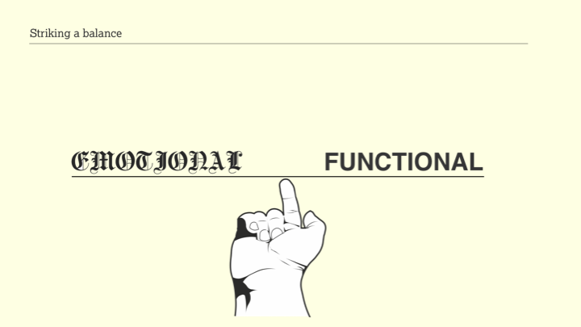
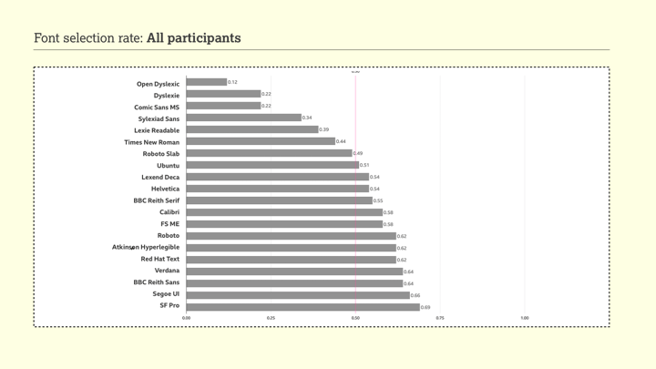
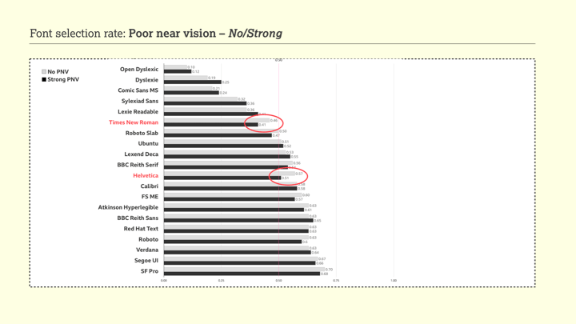
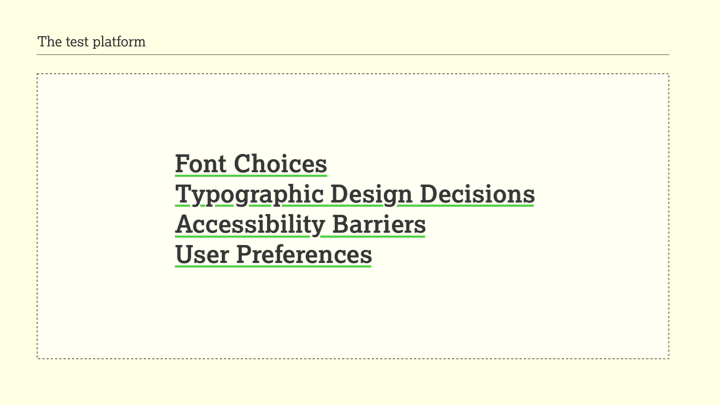
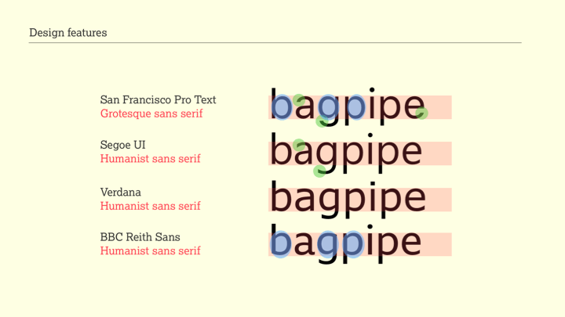
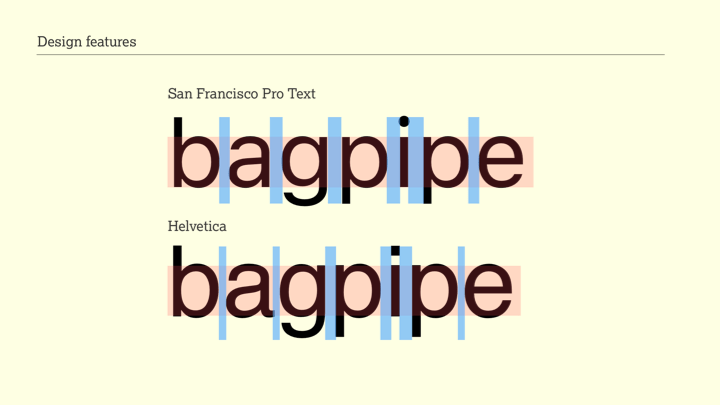
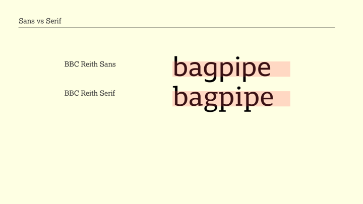
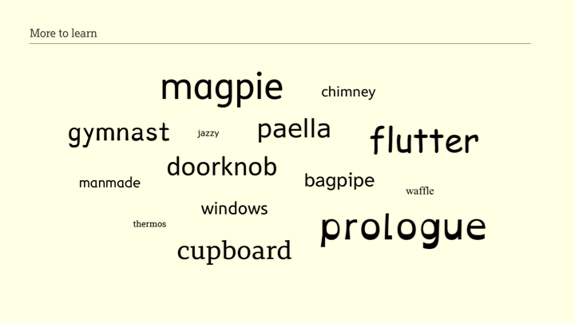

# Don’t believe the type

Converted to Markdown / HTML, with images of the slides.

## Slide 1 - Don’t believe the type

The text reads "Don't believe the type."

## Slide 2 - The Readability Group

This slide features names and social media handles of three individuals:

- David Bailey (@davidkiosk)
- Gareth Ford Williams (@GarethFW)
- Bruno Maag (@bruno_maag)

## Slide 3 - The Readability Group survey

On the laptop screen, the word "bagpipe" is displayed twice side by side.

## Slide 4 - The 3 pillars of accessibility

Lists the three pillars of accessibility:

- Emotional
- Technical
- Functional

## Slide 5 - The 3 pillars of accessibility

Lists the "3 pillars of accessibility" and includes:

- Emotional → Is it appealing?
- Technical → Was it built correctly?
- Functional → Does it work?

## Slide 6 - The 3 pillars of accessibility

Highlights the term "Emotional" from the first slide with a red circle and an arrow pointing to it, reiterating its connection to the question "Is it appealing?"

## Slide 7 - Brand expression

Shows three different examples of typefaces used in branding:

- The first example shows a colorful alphabet in a casual, child-like typeface associated with Nickelodeon.
- The second example displays four weights (light, regular, medium, bold) of the Intel brand font, labeled "intel one."
- The third example states "Handwritten lettering defines the LUSH brand".
- The fourth example states "Horseferry & Chadwick – a family of display and information fonts by Channel 4"

## Slide 8 - Brand expression

Compares two images:

- The left image features two people, one holding a Burberry check pattern bag, both wearing coats and styled in a vintage fashion with the Burberry logo underneath.
- The right image shows two people in modern styling, wearing Burberry check pattern clothes, with the updated Burberry London England logo beneath them.

There is a red arrow pointing from the left image to the right one, indicating a progression or change in brand expression over time.

## Slide 9 - Brand expression

- Left side shows two versions of the Burberry logo. The first logo has a knight on a horse carrying a flag and is accompanied by the text "BURBERRY" and below it "LONDON".
- Right side shows an updated version of the Burberry logo with a more modern sans-serif typeface. The word "BURBERRY" is larger and below it is the text "LONDON ENGLAND".

## Slide 10 Fashion vs function

An image of an ancient manuscript with Gothic script text. It's a close-up showing detailed blackletter calligraphy. A red cursor is visible in the text.

## Slide 11 - Fashion vs function

There are three elements:

- The logo for "The New York Times" in its distinctive typeface at the top.
- Below left, an album cover for "Motörhead England 1975" featuring the iconic Snaggletooth emblem.
- Below right, a photograph of a person's knuckles, with each knuckle tattooed to spell out "TRUE LOVE".

## Slide 12 - Fashion vs function

A close-up image of a hand holding an ancient text with German Gothic script. The text is dense and meticulously written.

## Slide 13 - Striking a balance

An illustration of a finger pushing a scale balance between the words "EMOTIONAL" and "FUNCTIONAL."

## Slide 14 - The Readability Group survey

A two-column list of font names is presented. Left Column:

- Atkinson Hyperlegible
- BBC Reith Sans
- BBC Reith Serif
- Calibri
- Comic Sans
- Dyslexie
- FSM
- Helvetica
- Lexend Deca
- LexieReadable

Right Column:

- Open Dyslexic
- Red Hat
- Roboto
- Roboto Slab
- Segoe
- SF Pro
- Sylexiad Sans
- Times New Roman
- Ubuntu
- Verdana

## Slide 15 - High exposure

A list indicating the exposure level of different fonts.

High exposure fonts used in "Operating System UIs":

- SF Pro
- Roboto
- Segoe

Fonts noted as "Commonly used":

- Helvetica
- Times New Roman
- Calibri
- Verdana
- Comic Sans

## Slide 16 - Key stats

## Slide 17 - Font features

## Slide 18 - User characteristics

## Slide 19 - Poor near vision

## Slide 20 - Phonological Dyslexia characteristics

## Slide 21 - Font selection rate: All participants

## Slide 22 - Font selection rate: Dyslexic traits - No/Strong

## Slide 23 - Font selection rate: Poor near vision - No/Strong

## Slide 24 - Font selection rate: Words with letters "n" by Poor near vision - All

## Slide 25 - Legibility

## Slide 26 - The test platform

## Slide 27 - The top four

## Slide 28 - Design features

## Slide 29 - Design features

## Slide 30 - Design features

## Slide 31 - Design features

## Slide 32 - Design features

## Slide 33 - Poor performers

## Slide 34 - Sans vs Serif

## Slide 35 - Sans vs Serif

## Slide 36 - Sizing

## Slide 37 - Sizing

## Slide 38 - More to learn

## Slide 39 - This is just the beginning

## Slide 40 - Thank you

