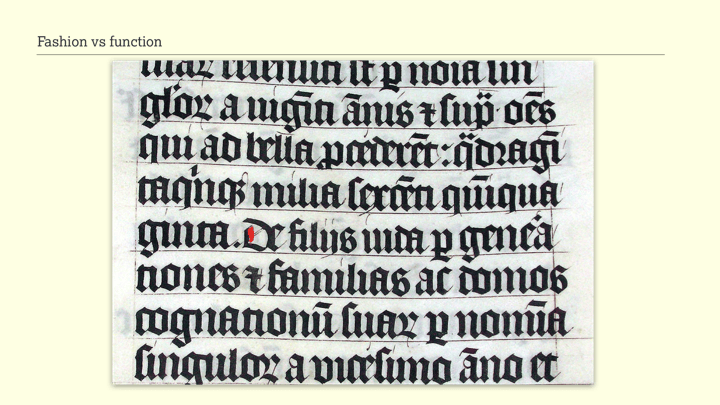
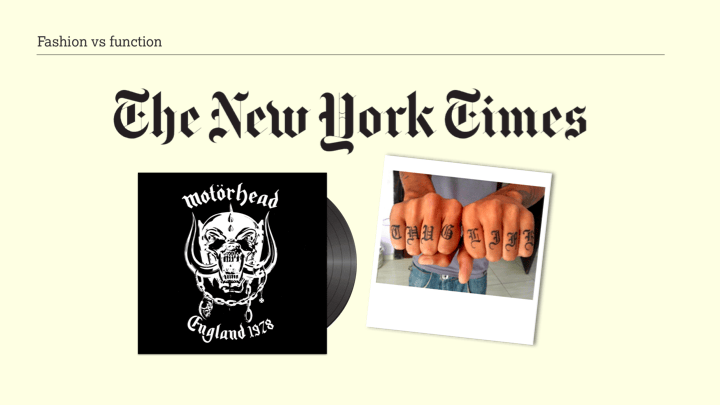
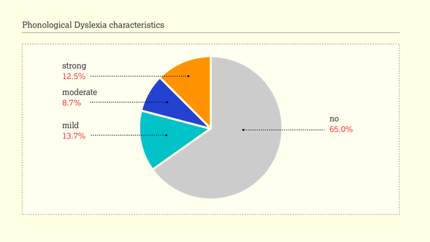
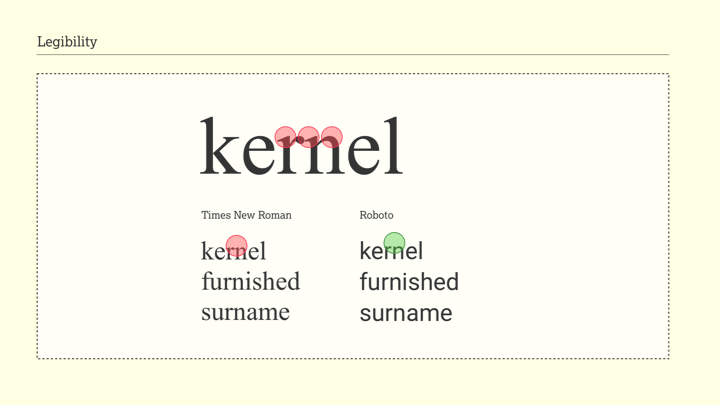
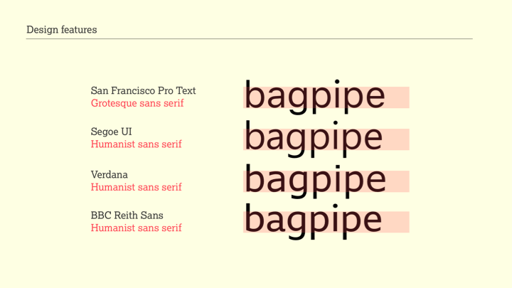
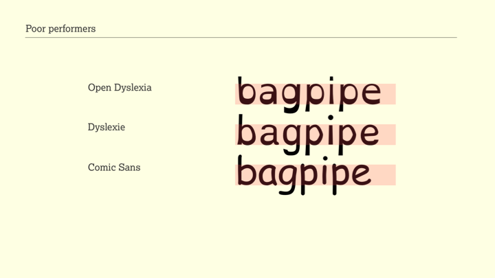
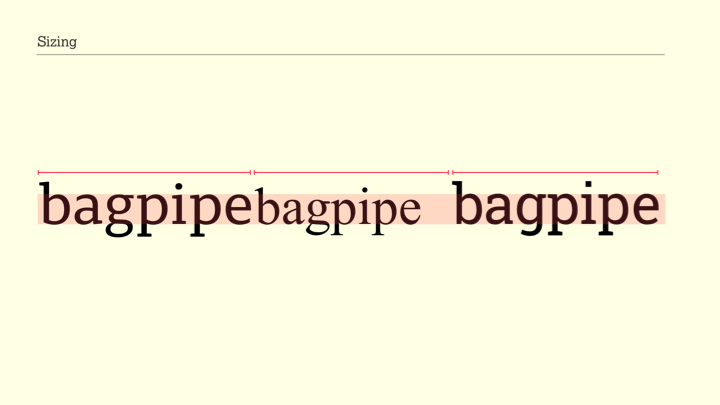
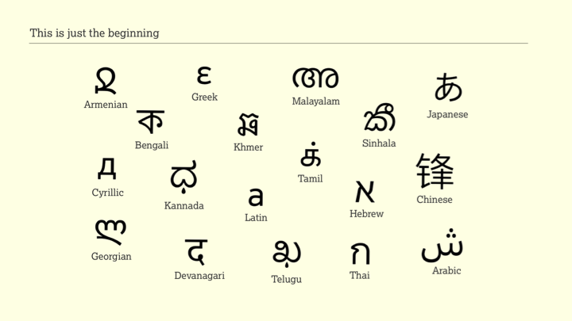

# Slides

## Slide 1 - Don’t believe the type

## Slide 2 - The Readability Group

## Slide 3 - The Readability Group survey

## Slide 4 - The 3 pillars of accessibility

## Slide 5 - The 3 pillars of accessibility

## Slide 6 - The 3 pillars of accessibility

## Slide 7 - Brand expression

## Slide 8 - Brand expression

## Slide 9 - Brand expression

## Slide 10 Fashion vs function

## Slide 11 - Fashion vs function

## Slide 12 - Fashion vs function

## Slide 13 - Striking a balance

## Slide 14 - The Readability Group survey

## Slide 15 - High exposure

## Slide 16 - Key stats

## Slide 17 - Font features

## Slide 18 - User characteristics

## Slide 19 - Poor near vision

## Slide 20 - Phonological Dyslexia characteristics

## Slide 21 - Font selection rate: All participants

## Slide 22 - Font selection rate: Dyslexic traits - No/Strong

## Slide 23 - Font selection rate: Poor near vision - No/Strong

## Slide 24 - Font selection rate: Words with letters "n" by Poor near vision - All

## Slide 25 - Legibility

## Slide 26 - The test platform

## Slide 27 - The top four

## Slide 28 - Design features

## Slide 29 - Design features

## Slide 30 - Design features

## Slide 31 - Design features

## Slide 32 - Design features

## Slide 33 - Poor performers

## Slide 34 - Sans vs Serif

## Slide 35 - Sans vs Serif

## Slide 36 - Sizing

## Slide 37 - Sizing

## Slide 38 - More to learn

## Slide 39 - This is just the beginning

## Slide 40 - Thank you

